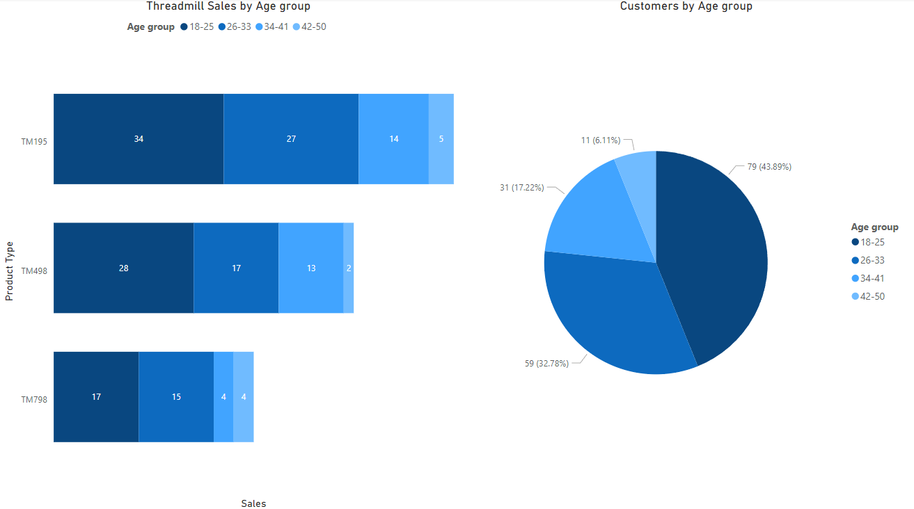
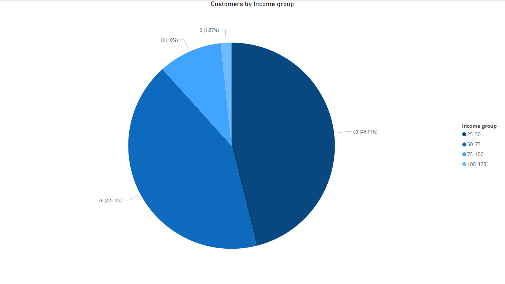
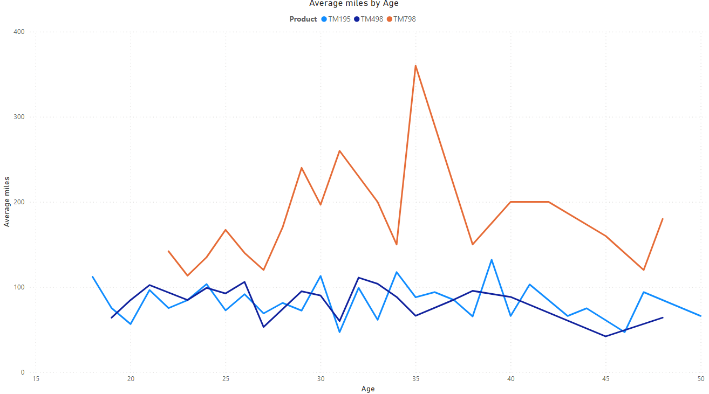

# CardioGoodFitness Case Study

## Table of Contents 

* [Defining the question](#defining_the_question)
* [Collecting Data](#collecting-data)
* [Cleaning the Data](#cleaning-data)
* [Analysing the Data](#analysing-data)
* [Visualising and sharing my findings](#visualising-data)
* [Insights gained](#insights-gained)
* [Actions to be taken](#actions-to-be-taken)

This data analysis project is based around the CardioGoodFitness Dataset.

The PowerPoint presentation for this project can be found and downloaded from this repository or through [here](https://drive.google.com/drive/folders/1y96eM2wnCzS5DHfC17z4AD9_uWC3nqp3?usp=sharing).

## Defining the Question 

Identify the key factors that decide which product customers purchase from CardioGoodFitness over the last 3 months and any actions that can be taken to improve product sales

[Back to Table of Contents](#table-of-contents)

## Collecting Data 

In order to answer this question I had to take a look at the CardioGoodFitness dataset, which can be found [here](https://www.kaggle.com/datasets/saurav9786/cardiogoodfitness/data).

[Back to Table of Contents](#table-of-contents)

## Cleaning the Data 

After collecting the data, I tried to perform cleaning and pre-processing tasks to make the data fit for analysis purposes. Fortunately, as the data was already cleaned of erroneous and null values, I did not need to perform any more data cleaning and pre-processing tasks.

[Back to Table of Contents](#table-of-contents)

## Analysing the Data 

After (attempting to) clean and pre-process the data, I used PowerBI to calculate, summarise and analyse the data to make comparisons and spot patterns and trends in the data.

Through this, I tried to check the link between product sales and different factors including: gender, marital status, age, income, (self-rated) fitness rating of the customers, average expected miles walked/ran and finally average planned usage amounts.

[Back to Table of Contents](#table-of-contents)

## Visualising and sharing my findings 

Finally, I decided to use PowerBI to visualise and share my findings from the data.

### Product Sales by Product Type

### Product Sales by Gender

### Product Sales by Marital Status

### Product Sales by Age Group

### Box plots of Ages

### Customers by Income Group

### Product Sales by Income Group

### Scatter chart of Customer Income by Age, for each Product Type

### Customers by Self-Rated Fitness Rating

#### Product Sales by Self-Rated Fitness Rating

### Line chart of Average Planned Miles by Age, for each Product Type

### Line Chart of Average Planned Usage Amounts by Age, for each Product Type

[Back to Table of Contents](#table-of-contents)

## Insights Gained 

CardioGoodFitness customers were more likely to be male than female, more likely to be partnered than single and most likely to be between the ages of 18-25.

TM195 was the most popular product regardless of the age group – Maybe it was viewed to be the most reliable product between all three offerings?

TM498 was the middle child in terms of sales yet statistics of customers did not seem to differ too much from TM195.

TM798 seemed to be preferred by more fit and higher income customers

[Back to Table of Contents](#table-of-contents)

## Actions to be taken 

Increase sales of products to females – perhaps find a way to promote the products to females more?

Increase sales of products to people not in relationships – perhaps through marketing or targeted ads.

Increase sales of TM498 by trying to market it towards a different base than TM195 as it seemed to attract the same customer base as TM195.

Increase sales of TM798 to less fit and lower income users as it seemed to be marketed as a premium product only suited to more fit users – Maybe through sales/promotions and targeted marketing?

[Back to Table of Contents](#table-of-contents)

